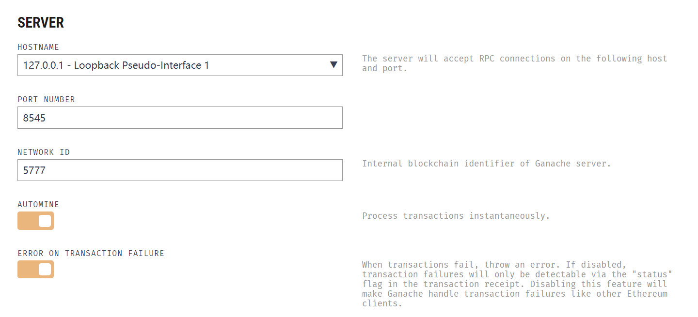
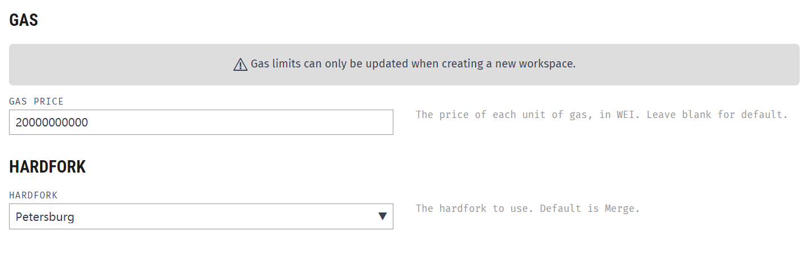
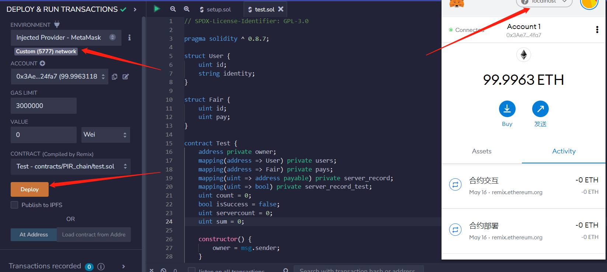
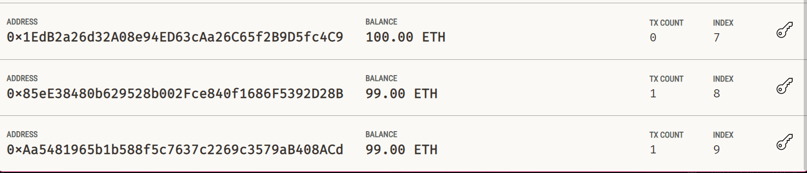
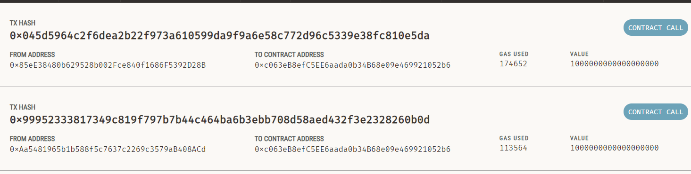
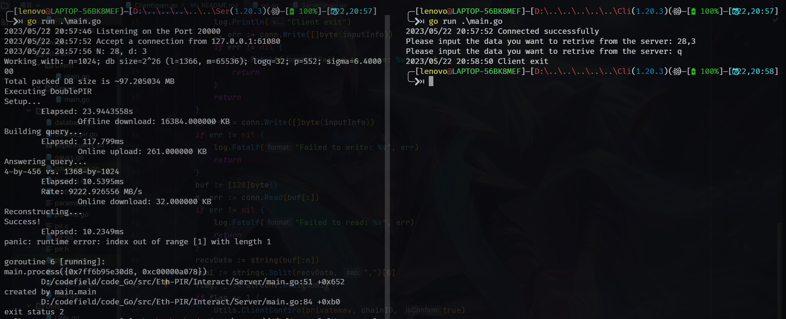
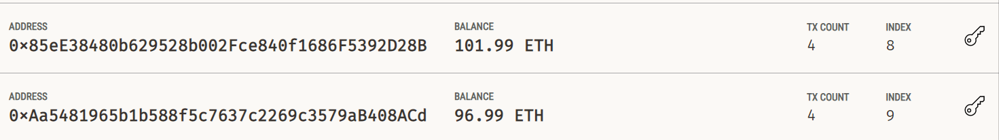
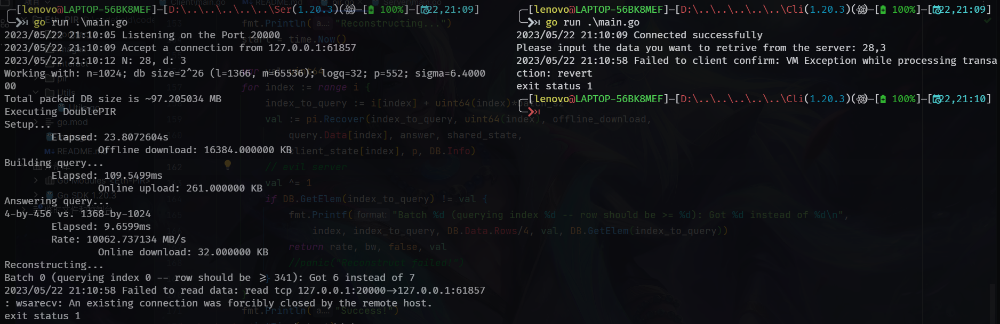
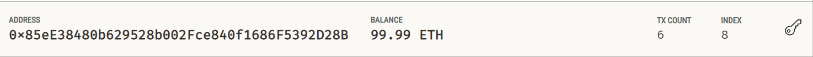

# Eth-PIR
## 简介
Eth-PIR 是一个使用以太坊中智能合约的特性来解决私有信息检索(Private Information Retrieval)中存在恶意服务器的项目。

该项目的目标是实现一个可以在以太坊上运行的PIR协议，借助以太坊的智能合约特性，使得PIR协议可以在不信任的服务器上运行，从而解决PIR协议中存在的恶意服务器问题。

当然，实现的只是一个很不完备的小demo，但是可以作为一个很好的起点，来实现更加完善的PIR协议。

## 项目依赖
* [Go](https://golang.org/)
* [Solidity](https://solidity.readthedocs.io/en/v0.5.3/)
* [Ganache](https://truffleframework.com/ganache)
* [Truffle](https://truffleframework.com/truffle)

## 项目结构
* `contracts/`：存放智能合约代码
* `utils/`：存放一些工具代码
* `pir/`：PIR 协议的 Go 实现(参考[SimplePIR](https://github.com/ahenzinger/simplepir))
* `Interact/`：交互的客户端与服务端实现
* `main.go`：项目入口
* `README.md`：项目说明文档

## 项目运行示例
### 1. 启动 Ganache
```bash
$ ganache-cli
```
进行相应的配置，这里设置 `ganache` 的RPC端口为 `8545`，网络ID为 `5777`：

`gas price` 和 `hardfork` 设置如下：

### 2. 部署智能合约
这里使用 `remix` 来部署合约，首先需要将 `metamask` 连接至本地的 `ganache`。

打开 `remix`，将 `contracts/PIR.sol` 中的代码复制到 `remix` 中，选择 `Solidity Compiler`，编译合约，
选择 `Run`，选择 `Injected Web3`，点击 `Deploy`，部署合约：

### 3. 运行客户端与服务端
这里需要开启两个终端，一个运行客户端，一个运行服务端。
```bash
$ ./server go run main.go
```
```bash
$ ./client go run main.go
```
在运行 PIR 协议时，可以看到客户端与服务端的交互过程：
* 首先客户端进行付费，服务端也缴纳相应的保证金

* 也可以看到合约调用的事件：

* 整个交互过程的日志：

* 最后服务端得到了客户端的报酬：

### 4. 服务端存在恶意服务器
在 PIR 协议 `Recover` 时，可以检测数据是否重构成功，利用这一点来判断是否有服务器作恶。存在服务器作恶时，输出日志如下：

其响应支付的保证金被扣除：



## 项目参考
* [SimplePIR](https://github.com/ahenzinger/simplepir)
* [go-ethernum](https://goetheanum.ch/en)
* [One Server for the Price of Two: Simple and Fast Single-Server Private Information Retrieval](https://eprint.iacr.org/2022/949)